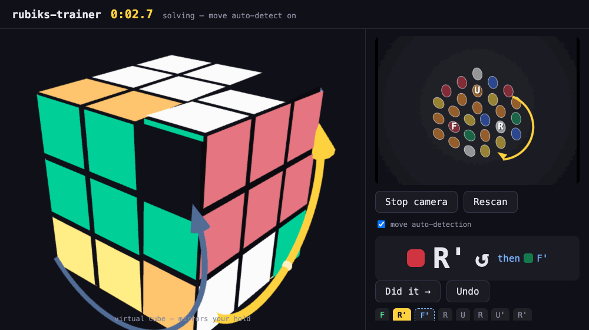

# rubiks-trainer

Real-time Rubik's Cube trainer in the browser. Point your webcam at a
scrambled cube, rotate it until all stickers are recognized, then follow
the on-screen move instructions — the app watches the cube and advances
the solution as it sees you turn faces.

Fully client-side: no backend, no video leaves your machine. Works as a
static site (GitHub Pages friendly).

**Live demo: [bitsparkcode.github.io/rubiks-trainer](https://bitsparkcode.github.io/rubiks-trainer/)**



## Features

- **Continuous tracking** — no step-by-step scanning. Tumble the cube
  freely; the app keeps measuring every frame and files each sticker
  sighting into the right slot until all 54 are known.
- **Live 3D mirror** — the virtual cube rotates to match how you're
  physically holding the real one, so the display always matches your
  hands.
- **Guided solve** — the solver (cubing.js two-phase, typically ~20
  moves) produces the full sequence up front. The current move gets a
  bold rotational arrow + looping turn animation on the 3D cube.
- **Lookahead** — the *following* move is shown as a second, subdued
  arrow so you can pre-position your fingers, like watching ahead in
  speedsolving.
- **Move auto-detection** — the app watches each face's 3×3 pattern and
  detects quarter/half turns as you execute them, advancing the solution
  automatically. Manual **Did it →** / **Undo** buttons and a toggle are
  always available.
- **Solve timer** — starts when the scan completes, stops at solved.
- **On-screen overlay** — detected grids, face letters, and a direction
  arrow are drawn directly on the webcam feed.
- **Private by design** — everything runs in your browser tab; the
  camera stream never leaves your machine.

## Quick start

```sh
npm install
npm run dev      # http://localhost:5173
```

Click **Start camera**, hold the cube so a corner points roughly at the
camera (three faces visible), and slowly rotate it. When all 54 stickers
are locked in, the solver runs and shows each move with an arrow drawn on
the live video. Turn the indicated face and it automatically moves to the
next step (or press **Space** / click **Did it →**).

## How it works

### Perception (`src/vision/`)

- `detect.ts` — the frame is downscaled, saturated/bright pixels are
  masked, an erosion pass splits neighboring stickers, and connected
  components yield sticker candidates. Pure TypeScript, no OpenCV.
- `grids.ts` — RANSAC fits up to three affine 3×3 lattices over sticker
  centroids; each lattice is one visible face. Missing/occluded cells are
  sampled at their predicted lattice point.
- `color.ts` — CIE Lab conversion. No hard-coded color table: the six
  face colors are learned online from observed **center stickers**.
- `tracker.ts` — the interesting part:
  - The three visible faces are sorted clockwise on screen; the cube's
    orientation is estimated by enumerating the 24 valid corner triples,
    constrained by center colors and by continuity with the previous
    frame. Mirrored cameras are detected and handled.
  - Lattice axes are mapped to cube-space directions using the observed
    directions to neighboring faces, so every sampled sticker lands on a
    canonical facelet index.
  - During solving, each face's canonical 3×3 grid is compared
    frame-to-frame; a stable 90°/180° change is emitted as a turn event
    and matched against the expected move.

### Cube model (`src/cube/`)

- `geom.ts` — facelet indexing conventions (Kociemba order `URFDLB`),
  cubie positions, per-face canonical row/col axes.
- `sim.ts` — facelet-level move tables (U R F D L B with exact strip
  alignments), verified against cubing.js's own permutations by
  `npm run verify:moves`.
- `solve.ts` — converts the facelet string to a cubing.js `KPattern` and
  calls `experimentalSolve3x3x3IgnoringCenters` (min2phase / twsearch).

### Rendering

- `src/render/cube3d.ts` — Three.js model mirroring the tracked state and
  physical orientation, looping a preview animation of the next move
  with a rotational arrow, plus a ghosted arrow for the move after that
  (lookahead).
- `demo.html` / `src/demo.ts` — standalone demo of the 3D view driving a
  sample solution; `npm run demo:record` re-records `assets/demo.gif`
  (requires local Chrome).
- Overlay canvas draws detected grids, face letters, and a direction
  arrow for the expected move on the live video.

## Conventions & limitations

- Face letters are assigned by first sight: the first confidently-seen
  triple becomes (U, R, F). The move display shows a color chip next to
  the letter, and the chip uses the color learned from that face's
  center sticker.
- Move auto-detection watches the expected face's 3×3 pattern for a
  stable quarter-turn. Fingers occluding stickers or fast flick turns can
  confuse it — manual advance is always available, and you can toggle
  auto-detection off.
- Stickerless cubes, very glossy stickers, extreme lighting, or
  nonstandard color schemes will degrade recognition. Standard Western
  scheme (BOY clockwise) is assumed implicitly by chirality checks, but
  arbitrary color *values* are fine since they are learned.

## Scripts

- `npm run dev` — dev server
- `npm run build` — typecheck + production build (`dist/`)
- `npm run verify:moves` — sanity-check move tables and the
  facelet→KPattern conversion against cubing.js
- `npm run demo:record` — re-record the README demo GIF via headless
  Chrome (runs `vite preview` + `demo.html`)

## License

MIT
